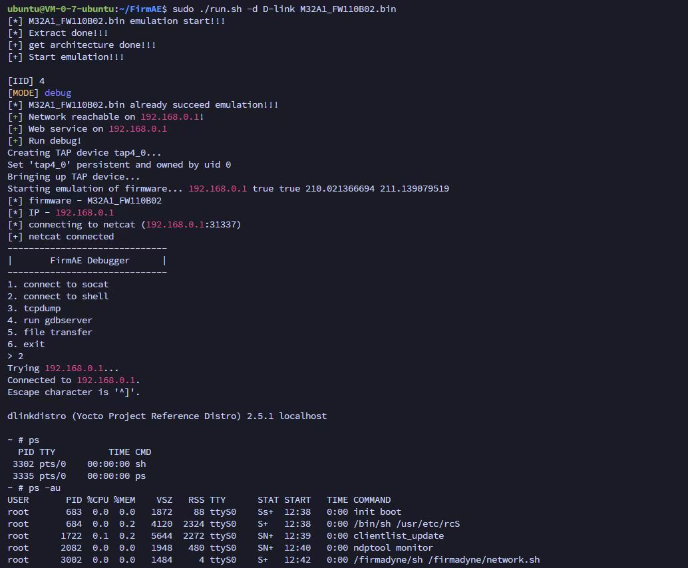

# FirmAE-pro

FirmAE-pro is an enhanced and extended version of FirmAE, an automated firmware emulation framework for firmware analysis, debugging, and research.

This repository now contains an unpacked source snapshot of the March 2026 release, together with a repackaged public archive generated from the curated repository contents.

## Overview

Compared with the original FirmAE workflow, this customized version focuses on broader platform compatibility and more practical runtime analysis capabilities.

It is intended for firmware emulation, debugging, reverse engineering, and controlled security research workflows.

## Features

- Support for multiple kernel variants
- Added `arm64` firmware emulation support
- Support for firmware decryption workflows
- Support for patching and hook-based analysis
- Improved debugging-oriented emulation workflow
- Better suitability for emulation-assisted firmware reversing

## Supported Architectures

- `mipseb`
- `mipsel`
- `armel`
- `armhf`
- `aarch64`

## Repository Layout

- `scripts/` - emulation, setup, networking, and kernel build helpers
- `sources/` - helper sources such as console, extractor, scraper, and libnvram components
- `analyses/` - analyzer, fuzzer, and RouterSploit-related components
- `binaries/` - runtime helpers and selected prebuilt binaries used by the framework
- `core/` - helper tools used during setup and execution
- `database/` - database schema and related files
- `assets/` - README images and supporting media

## Included Release Archive

The full packaged release is still included in this repository:

- `FirmAE-20260304.tar.zst`
- `FirmAE-20260304.tar.zst.sha256`

SHA-256:

`8b108b2ec42f45ab29411e1a846e39ca1eae60db5efe213451c1ec32795443ba`

## Quick Start

1. Install dependencies:

```bash
./download.sh
./install.sh
```

2. Initialize the environment:

```bash
./init.sh
```

3. Run firmware emulation:

```bash
sudo ./run.sh -c <brand> <firmware>
```

4. Use debug mode when needed:

```bash
sudo ./run.sh -d <brand> <firmware>
```

## Screenshots

The screenshot below shows a successful emulation and debugger workflow in action.



## Notes

- Local AI/session state, scratch data, heavyweight kernel source trees, and internal working metadata are intentionally excluded from both the repository layout and the repackaged public archive.
- The included archive is intended as a clean public release package rather than a raw working-directory backup.

## Disclaimer

This project is intended for authorized firmware research, debugging, security analysis, and educational use only.

Users are responsible for ensuring that all analysis, emulation, decryption, patching, and hooking activities comply with applicable laws, regulations, and authorization requirements.
